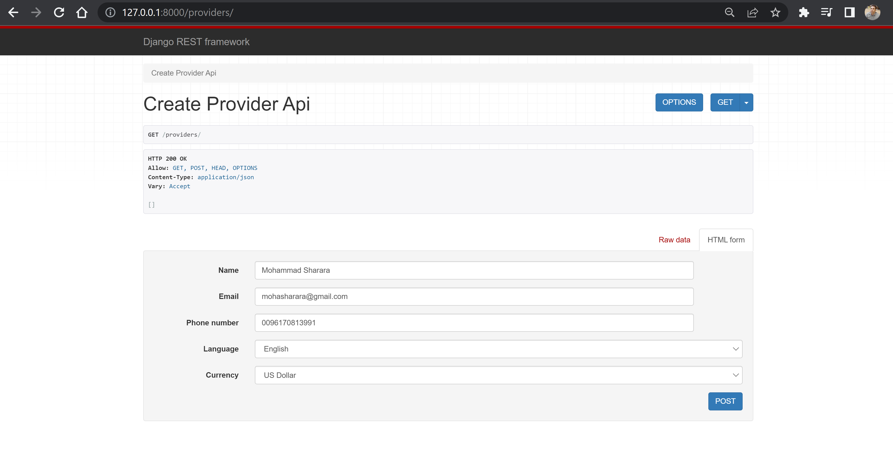
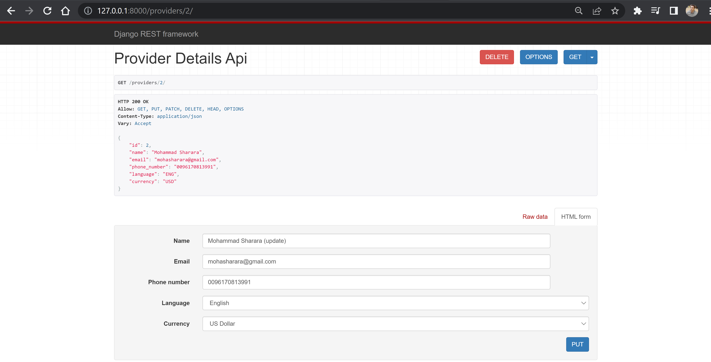
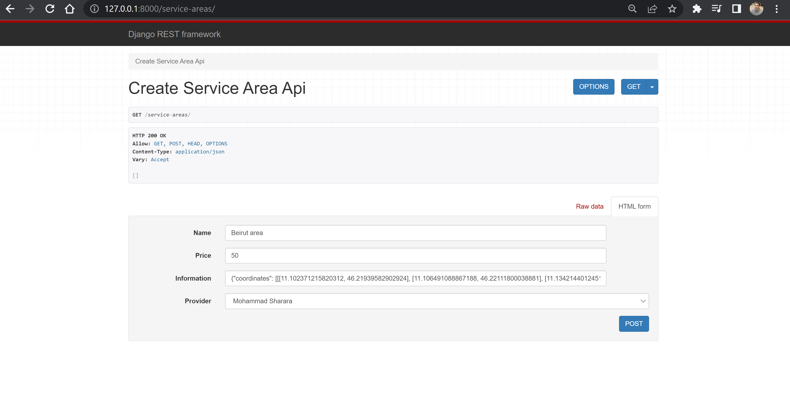
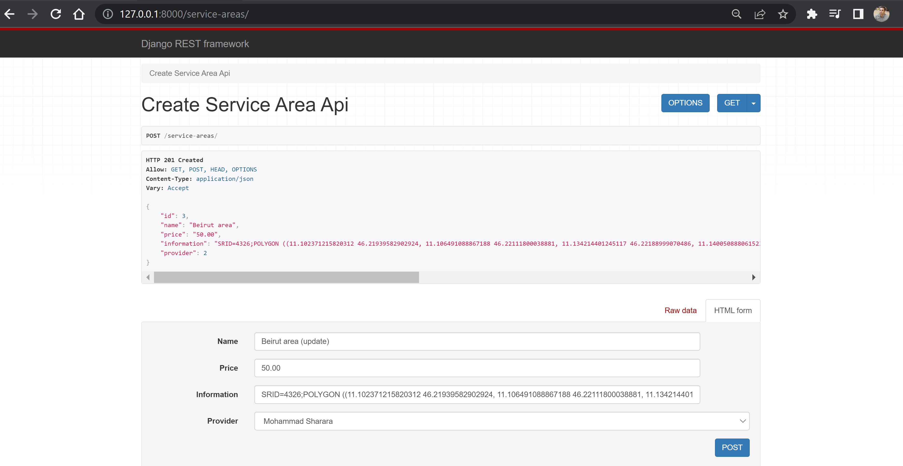
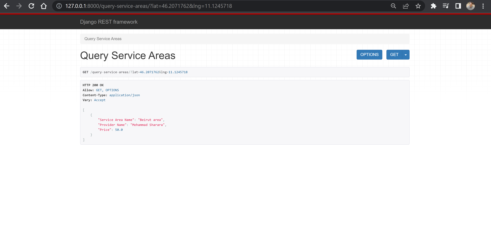

# Mozio-Backend-Potential-hire-Project-2.0

> This is an API application for Mozio transportation services.

### Setting up the virtual environment and dependencies:
1. clone the repo locally and cd to its folder
2. hit `python3 -m venv venv` to create a virtual environment
3. hit `source venv/bin/activate` to activate the virtual environment
4. while the environment is activated, hit `pip install -r requirements.txt` to install dependencies
5. hit `pip list` to verify the dependencies have been installed
6. install Postgres and run the Postress server following this guide: (https://www.digitalocean.com/community/tutorials/how-to-install-and-use-postgresql-on-ubuntu-18-04)
7. inside Postgres, create an empty db called `mozio` 
8. hit `python3 manage.py migrate` to apply the migrations (Postgres server must be running)
9. hit `python3 manage.py createsuperuser` to create the superuser
10. change GDAL_LIBRARY_PATH and set it to the path of gdal on your PC.

### Running the application:
1. make sure you are inside the project's top level directory, and venv is activated
2. make sure the Postgres server is running, otherwise a new database will be created each time you run the server
3. check for uncreated or unapplied migrations: `python3 manage.py makemigrations && python3 manage.py migrate`
4. hit `python3 manage.py runserver` and access the application at the given port

## Create Provider Api

Visit this link providers/

In order to create a new provider, insert Name, Email, Phone number, Language and Currency, then press Post.

Above is the list of all providers.

## Provider Details Api

Visit this link providers/<int:pk>/

The pk is the primary key of the provider and should be an integer.

in this case providers/2/

In order to Update a provider, edit Name, Email, Phone number, Language or Currency, then press Put.
In order to Delete a provider, simply press Delete.

## Create Service Area Api

Visit this link service-areas/

In order to create a new service area, insert Name, Price, Information, and select Provider.
Information needs to be a 

As in this example:
"SRID=4326;POLYGON ((11.102371215820312 46.21939582902924, 11.106491088867188 46.22111800038881, 11.134214401245117 46.22188999070486, 11.140050888061523 46.21791115519151, 11.141080856323242 46.21422899084459, 11.137990951538086 46.207695510993354, 11.13412857055664 46.20122065978115, 11.12485885620117 46.198844376182535, 11.102371215820312 46.21939582902924))",

Above is the list of all Service areas.

## Service Area Details Api

Visit this link service-areas/<int:pk>/

The pk is the primary key of the service area and should be an integer.

in this case service-areas/2/

In order to Update a service area, edit Name, Price, Information, or select different Provider. then press Put.
In order to Delete a service area, simply press Delete.

## Query Service Areas

Visit this link query-service-areas/

In order to search if a point is inside a Service area, add lat & lng to the url
lat = lattitude
lng = longitude 

example:
Visit this link query-service-areas/?lat=46.2071762&lng=11.1245718

Above shows the result(s) of the query

